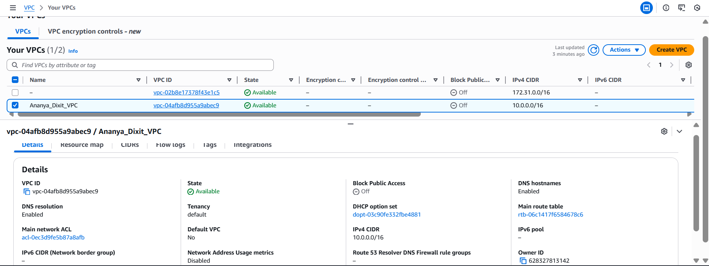
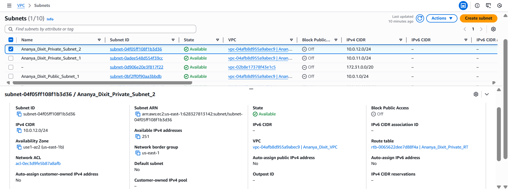
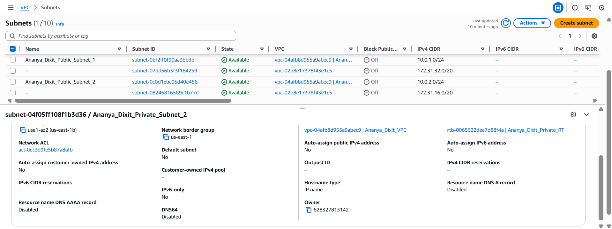
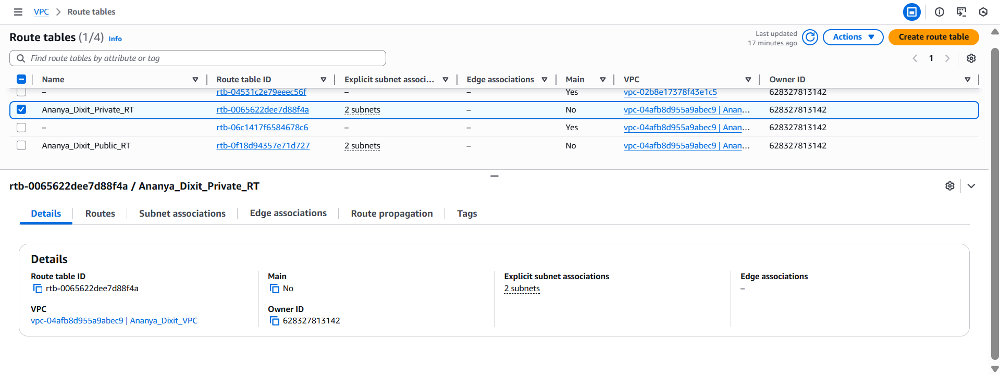
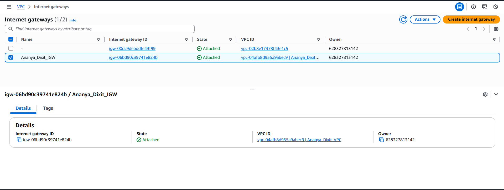
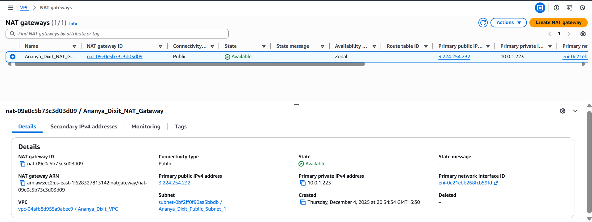

# Task 1: Networking & Subnetting (AWS VPC Setup)

## My Approach

For this task, I created a VPC with the CIDR block 10.0.0.0/16, giving us plenty of IP addresses to work with. I split the network into four subnets spread across two availability zones (us-east-1a and us-east-1b) to ensure high availability. The public subnets (10.0.1.0/24 and 10.0.2.0/24) are for resources that need direct internet access through the Internet Gateway, while the private subnets (10.0.11.0/24 and 10.0.12.0/24) are for backend services that connect to the internet securely through a NAT Gateway. This setup keeps our private resources protected while still allowing them to reach external services when needed.

## CIDR Ranges and Why I Chose Them

| Resource | CIDR Range | Available IPs | Purpose |
|----------|------------|---------------|---------|
| **VPC** | 10.0.0.0/16 | 65,536 | Main network |
| **Public Subnet 1** | 10.0.1.0/24 | 251 usable | Public resources in us-east-1a |
| **Public Subnet 2** | 10.0.2.0/24 | 251 usable | Public resources in us-east-1b |
| **Private Subnet 1** | 10.0.11.0/24 | 251 usable | Private resources in us-east-1a |
| **Private Subnet 2** | 10.0.12.0/24 | 251 usable | Private resources in us-east-1b |

### Why These Specific Ranges?

I went with **10.0.0.0/16** for the VPC because it gives us 65,000+ IP addresses, which is more than enough for future expansion. It's also a standard private IP range that won't conflict with public internet addresses.

For the subnets, I used **/24 masks** (256 IPs each, 251 usable after AWS reserves 5). The public subnets start at 10.0.1.0 and 10.0.2.0 for easy identification. I intentionally left a gap and started private subnets at 10.0.11.0 and 10.0.12.0 - this gives us room to add more public subnets later if needed (like 10.0.3.0, 10.0.4.0, etc.) without reorganizing everything.

## Network Architecture

```
VPC: 10.0.0.0/16
│
├── Internet Gateway (for public internet access)
│
├── Public Subnet 1 (10.0.1.0/24) - us-east-1a
│   └── NAT Gateway (deployed here)
│
├── Public Subnet 2 (10.0.2.0/24) - us-east-1b
│
├── Private Subnet 1 (10.0.11.0/24) - us-east-1a
│   └── Routes internet traffic through NAT Gateway
│
└── Private Subnet 2 (10.0.12.0/24) - us-east-1b
    └── Routes internet traffic through NAT Gateway
```

## AWS Console Screenshots

### VPC

*Shows the VPC with CIDR 10.0.0.0/16 in available state*

### Subnets


*All four subnets (2 public, 2 private) across two availability zones*

### Route Tables

*Public route table with IGW route and Private route table with NAT Gateway route*

### Internet Gateway

*Internet Gateway attached to the VPC*

### NAT Gateway

*NAT Gateway deployed in public subnet for private subnet internet access*

## How to Deploy This Infrastructure

### Prerequisites
- AWS account with CLI configured
- Terraform installed
- Appropriate IAM permissions

### Deployment Steps

1. Clone this repository and navigate to task1 folder
2. Initialize Terraform:
   ```bash
   terraform init
   ```

3. Review what will be created:
   ```bash
   terraform plan
   ```

4. Deploy the infrastructure:
   ```bash
   terraform apply
   ```
   Type `yes` when prompted

5. Wait 3-5 minutes for all resources to be created (NAT Gateway takes the longest)

### Cleanup

To avoid AWS charges, destroy all resources after use:
```bash
terraform destroy
```
Type `yes` when prompted

## Resources Created

This Terraform configuration creates:
- 1 VPC (10.0.0.0/16)
- 4 Subnets (2 public, 2 private)
- 1 Internet Gateway
- 1 NAT Gateway
- 1 Elastic IP (for NAT Gateway)
- 2 Route Tables with appropriate routes
- Route table associations for all subnets

## Important Notes

**Cost Warning:** NAT Gateway costs about $0.045/hour (~$32/month) plus data transfer charges. Make sure to destroy resources after the assessment!

**Region:** All resources are deployed in us-east-1 (N. Virginia)

**Naming:** All resources are prefixed with "Ananya_Dixit_" for easy identification
