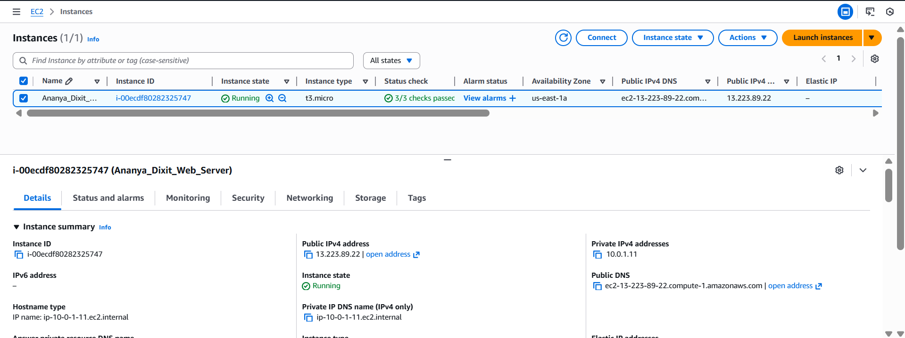
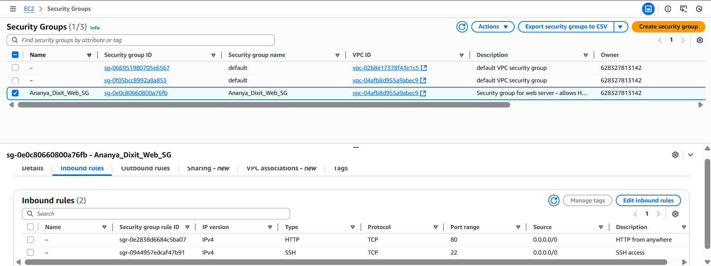
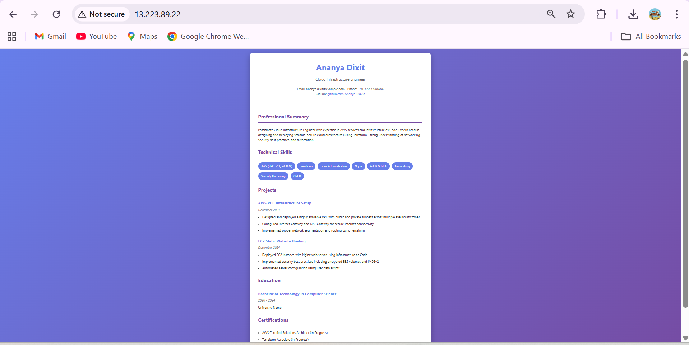

# Task 2: EC2 Static Website Hosting

## My Approach

For this task, I launched a t2.micro EC2 instance in the public subnet created in Task 1. I used Amazon Linux 2023 as the operating system and automated the entire setup using a user data script. The script installs Nginx, creates a professional resume website, and configures the web server to run on port 80. For security hardening, I implemented several best practices including encrypted EBS volumes, IMDSv2 enforcement, restricted security group rules, and proper IAM configurations. The website is accessible via the instance's public IP address.

## Infrastructure Setup Details

**EC2 Instance Configuration:**
- Instance Type: t2.micro (Free Tier eligible)
- AMI: Amazon Linux 2023
- Subnet: Public subnet from Task 1
- Public IP: Auto-assigned
- Storage: 8GB encrypted EBS volume (gp3)

**Security Hardening Measures:**
1. EBS volume encryption enabled
2. IMDSv2 enforced (prevents SSRF attacks)
3. Security group with minimal required ports (80 for HTTP, 22 for SSH)
4. Automated patching via user data script
5. Firewalld disabled (using security groups instead)
6. Root volume set to delete on termination

**Nginx Configuration:**
- Installed via yum package manager
- Configured to listen on port 80
- Serving custom resume HTML from /usr/share/nginx/html/
- Auto-starts on boot

## AWS Console Screenshots

### EC2 Instance

*Shows the running EC2 instance with public IP*

### Security Groups

*Security group rules allowing HTTP (80) and SSH (22)*

### Website in Browser

*Resume website accessible via public IP on port 80*

## Deployment Instructions

### Prerequisites
- Completed Task 1 (VPC setup must exist)
- AWS CLI configured
- Terraform installed

### Steps to Deploy

1. Navigate to task2 folder:
   ```bash
   cd task2
   ```

2. Initialize Terraform:
   ```bash
   terraform init
   ```

3. Review the deployment plan:
   ```bash
   terraform plan
   ```

4. Deploy the infrastructure:
   ```bash
   terraform apply
   ```
   Type `yes` when prompted

5. Wait 2-3 minutes for the instance to launch and Nginx to install

6. Access the website:
   - Copy the public IP from the output
   - Open browser and go to: `http://PUBLIC_IP`

### Cleanup

To delete all resources and avoid charges:
```bash
terraform destroy
```
Type `yes` when prompted

## Files in This Task

- `main.tf` - Terraform configuration for EC2 instance and security group
- `setup.sh` - User data script that installs and configures Nginx
- `README.md` - This documentation file
- `screenshots/` - AWS console screenshots

## Resources Created

- 1 EC2 Instance (t2.micro)
- 1 Security Group (allows ports 80 and 22)
- 1 Encrypted EBS Volume (8GB)

## Important Notes

**Cost:** EC2 t2.micro is Free Tier eligible (750 hours/month). Make sure to destroy resources after assessment!

**Security:** The SSH port (22) is open to 0.0.0.0/0 for demonstration. In production, restrict this to your specific IP address.

**Website URL:** After deployment, the website will be accessible at the public IP shown in Terraform outputs.
