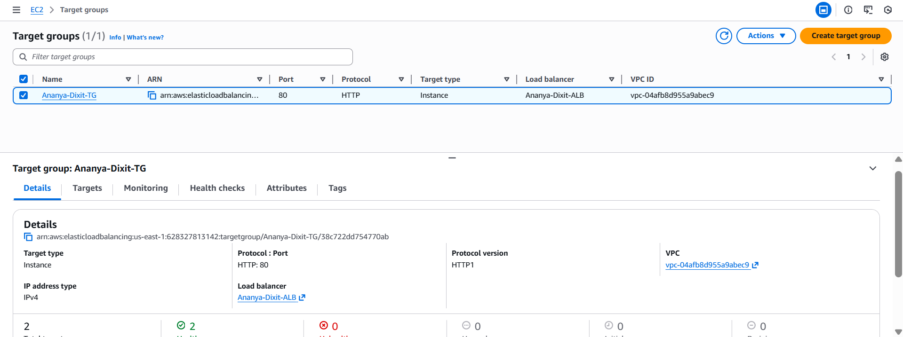
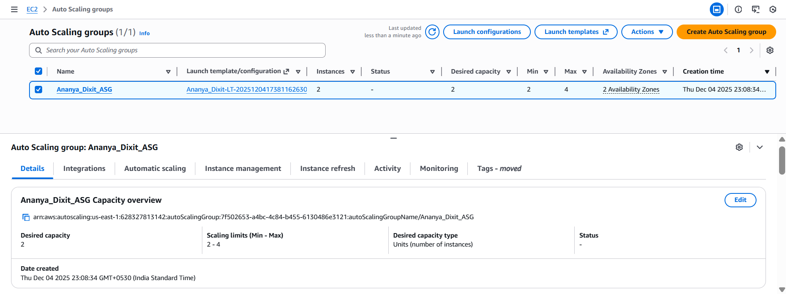
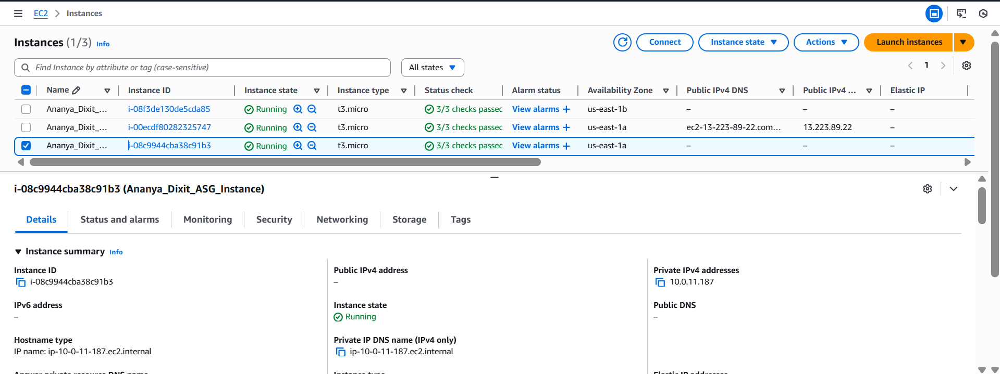

# Task 3: High Availability + Auto Scaling

## My Approach

For this task, I migrated the single EC2 instance setup from Task 2 to a highly available architecture. I created an Application Load Balancer in the public subnets to distribute traffic across multiple availability zones. The EC2 instances now run in private subnets for better security, with the ALB handling all incoming traffic from the internet. I set up an Auto Scaling Group with a minimum of 2 instances and maximum of 4 instances across both availability zones, ensuring the application remains available even if one AZ fails. The traffic flow is: Internet → ALB (public subnets) → Target Group → EC2 instances (private subnets) → NAT Gateway for outbound internet access.

## Architecture Overview

```
Internet
    ↓
Application Load Balancer (Public Subnets - AZ A & B)
    ↓
Target Group
    ↓
Auto Scaling Group (Private Subnets - AZ A & B)
    ↓
EC2 Instances (2-4 instances)
    ↓
NAT Gateway (for outbound traffic)
```

## High Availability Features

1. **Multi-AZ Deployment**: Resources spread across us-east-1a and us-east-1b
2. **Auto Scaling**: Automatically maintains 2-4 instances based on demand
3. **Load Balancing**: ALB distributes traffic evenly across healthy instances
4. **Health Checks**: ALB monitors instance health and routes traffic only to healthy targets
5. **Private Subnets**: EC2 instances isolated from direct internet access

## Traffic Flow

1. User accesses ALB DNS name (public)
2. ALB receives request on port 80
3. ALB forwards to healthy target in Target Group
4. EC2 instance in private subnet processes request
5. Response sent back through ALB to user
6. Outbound traffic from EC2 goes through NAT Gateway

## AWS Console Screenshots

### Application Load Balancer

*Application Load Balancer configuration with listeners and availability zones*

### Target Group

*Target group with registered instances and health check configuration*

### Auto Scaling Group

*Auto Scaling Group with min 2, max 4 instances across multiple AZs*

### EC2 Instances via ASG

*EC2 instances launched and managed by Auto Scaling Group*

## Deployment Instructions

### Prerequisites
- Completed Task 1 (VPC with public and private subnets)
- AWS CLI configured
- Terraform installed

### Steps to Deploy

1. Navigate to task3 folder:
   ```bash
   cd task3
   ```

2. Initialize Terraform:
   ```bash
   terraform init
   ```

3. Review the deployment plan:
   ```bash
   terraform plan
   ```

4. Deploy the infrastructure:
   ```bash
   terraform apply
   ```
   Type `yes` when prompted

5. Wait 3-5 minutes for instances to launch and pass health checks

6. Access the website using ALB DNS name from outputs

### Cleanup

To delete all resources:
```bash
terraform destroy
```
Type `yes` when prompted

## Resources Created

- 1 Application Load Balancer (internet-facing)
- 1 Target Group (HTTP:80)
- 1 Launch Template (for ASG)
- 1 Auto Scaling Group (min: 2, max: 4, desired: 2)
- 2-4 EC2 Instances (t3.micro in private subnets)
- 1 Security Group for ALB
- 1 Security Group for EC2 instances
- 1 S3 Bucket (for resume storage)

## Auto Scaling Configuration

- **Minimum Capacity**: 2 instances
- **Maximum Capacity**: 4 instances
- **Desired Capacity**: 2 instances
- **Health Check Type**: ELB
- **Health Check Grace Period**: 300 seconds
- **Availability Zones**: us-east-1a, us-east-1b

## Security Configuration

**ALB Security Group:**
- Inbound: HTTP (80) from 0.0.0.0/0
- Outbound: All traffic

**EC2 Security Group:**
- Inbound: HTTP (80) from ALB security group only
- Outbound: All traffic (for NAT Gateway access)

## Important Notes

**Cost**: ALB costs ~$0.0225/hour (~$16/month) + data processing charges. EC2 instances are Free Tier eligible.

**High Availability**: With 2 instances in different AZs, the application remains available even if one AZ fails.

**Scalability**: ASG automatically launches new instances if demand increases or existing instances fail.

**Website URL**: After deployment, access the website using the ALB DNS name shown in Terraform outputs.
