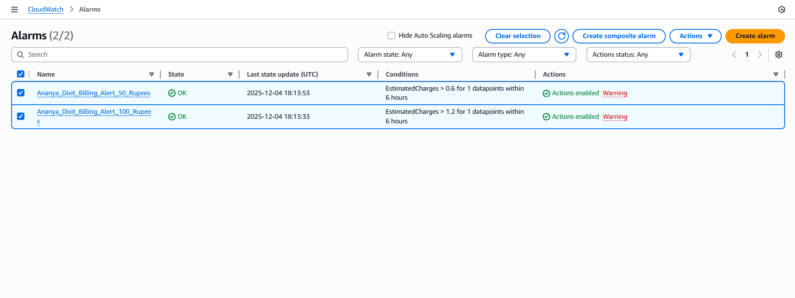
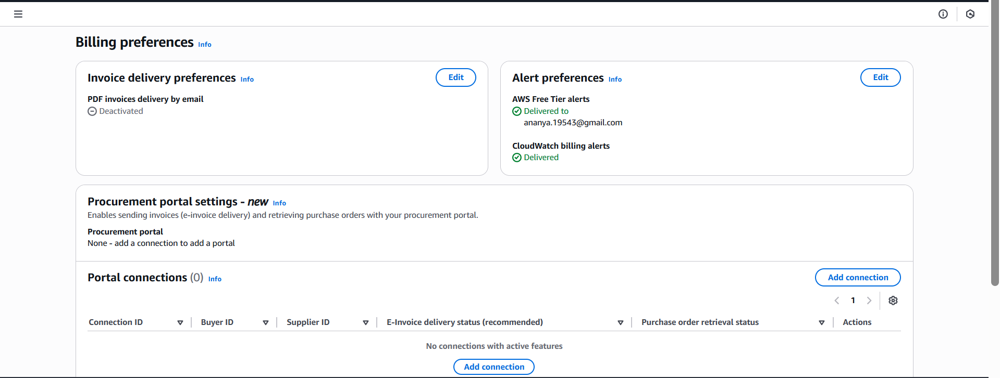

# Task 4: Billing & Free Tier Cost Monitoring

## My Approach

For this task, I configured AWS billing alerts to monitor costs and prevent unexpected charges. I set up a CloudWatch billing alarm that triggers when my estimated charges exceed ₹100 (approximately $1.20 USD). I also enabled Free Tier usage alerts to get notifications when I'm approaching or exceeding Free Tier limits. This is crucial for beginners because AWS charges can accumulate quickly if resources are left running unintentionally, and Free Tier limits can be exceeded without realizing it. These alerts act as an early warning system to help manage costs effectively.

## Why Cost Monitoring is Important for Beginners

When you're just starting with AWS, it's easy to accidentally leave resources running or misconfigure services that lead to unexpected charges. For example, a NAT Gateway costs about $32/month, and an Application Load Balancer adds another $16/month. Without monitoring, these costs can add up quickly. Free Tier gives you 750 hours of t2.micro/t3.micro instances per month, but if you exceed that or use larger instance types, you start getting charged. Cost monitoring helps you:

1. **Catch mistakes early** - If you forget to terminate an instance or delete a resource, the alarm notifies you before the bill gets too high
2. **Learn AWS pricing** - By tracking costs, you understand which services are expensive and which are free
3. **Stay within budget** - As a student or beginner, you likely have a limited budget, so staying under ₹100-200/month is important
4. **Avoid bill shock** - Getting a surprise $50 or $100 bill at month-end is stressful and avoidable with proper monitoring

## What Causes Sudden Increases in AWS Bills

Several things can cause unexpected cost spikes:

1. **Forgetting to delete resources** - The most common issue. You create resources for testing and forget to clean them up. NAT Gateways, Load Balancers, and running EC2 instances all cost money even when idle.

2. **Data transfer charges** - Moving data out of AWS (egress) costs money. If your application serves a lot of traffic or you download large files, these charges add up.

3. **EBS volumes** - Even if you stop an EC2 instance, the attached EBS volume continues to cost money ($0.10/GB/month). A 30GB volume costs $3/month.

4. **Elastic IPs not attached** - If you allocate an Elastic IP but don't attach it to a running instance, AWS charges $0.005/hour (~$3.60/month).

5. **Exceeding Free Tier limits** - Free Tier gives 750 hours/month of t2.micro. If you run 2 instances 24/7, that's 1,440 hours, exceeding the limit by 690 hours.

6. **Wrong instance types** - Using t3.small instead of t3.micro, or using instances in regions without Free Tier support.

7. **Snapshots and backups** - EBS snapshots accumulate over time. If you take daily snapshots and never delete old ones, storage costs increase.

8. **Load Balancer idle time** - ALBs cost money even when not serving traffic. If you create one for testing and leave it running, it's $16/month minimum.

## AWS Console Screenshots

### CloudWatch Billing Alarm

*CloudWatch alarm configured to trigger at ₹100 estimated charges*

### Free Tier Usage Alerts

*Free Tier usage alerts enabled for all services*

## Setup Instructions

### Step 1: Enable Billing Alerts

1. Go to AWS Console → Account (top right) → Billing and Cost Management
2. Click "Billing Preferences" in left sidebar
3. Check "Receive Free Tier Usage Alerts"
4. Enter your email address
5. Check "Receive Billing Alerts"
6. Click "Save preferences"

### Step 2: Create CloudWatch Billing Alarm

1. Go to CloudWatch service
2. Click "Alarms" → "Billing" → "Create alarm"
3. Click "Select metric"
4. Choose "Billing" → "Total Estimated Charge"
5. Select "USD" currency
6. Click "Select metric"
7. Set threshold: Greater than $1.20 (approximately ₹100)
8. Click "Next"
9. Create new SNS topic or select existing one
10. Enter email for notifications
11. Click "Create alarm"

### Step 3: Verify Email

1. Check your email inbox
2. Click the confirmation link from AWS SNS
3. Your alarm is now active

## Cost Breakdown for This Assessment

Here's what the infrastructure from Tasks 1-3 costs:

| Resource | Cost | Free Tier |
|----------|------|-----------|
| VPC, Subnets, Route Tables | Free | Yes |
| Internet Gateway | Free | Yes |
| **NAT Gateway** | ~$32/month | No |
| **Application Load Balancer** | ~$16/month | No |
| EC2 t3.micro instances (2x) | Free (within 750 hrs) | Yes |
| EBS volumes (30GB x 2) | ~$6/month | 30GB free |
| S3 storage | ~$0.10/month | 5GB free |
| **Total** | **~$54/month** | - |

**Important**: This is why cleanup is crucial! After the assessment, destroy all resources to avoid charges.

## Cleanup Commands

To avoid ongoing charges, destroy resources after assessment:

```bash
# Task 3 (destroy first - has dependencies)
cd task3
terraform destroy

# Task 2
cd ../task2
terraform destroy

# Task 1 (destroy last - other tasks depend on VPC)
cd ../task1
terraform destroy
```

## Best Practices for Cost Management

1. **Always set billing alarms** - Even if you're using Free Tier, set a low threshold
2. **Tag all resources** - Use tags like "Project: Assessment" to track costs per project
3. **Use AWS Cost Explorer** - Review your spending weekly
4. **Delete unused resources immediately** - Don't wait until month-end
5. **Stop instances when not in use** - Stopped instances don't incur compute charges (but EBS still costs)
6. **Use t3.micro instead of t2.micro** - t3 is newer and more cost-effective
7. **Avoid NAT Gateways for testing** - Use NAT instances or skip private subnets for simple projects
8. **Set up budget alerts** - AWS Budgets can send alerts at 50%, 80%, and 100% of your budget

## Important Notes

**Currency Conversion**: AWS bills in USD. ₹100 ≈ $1.20 (exchange rate varies)

**Free Tier Duration**: 12 months from account creation date

**Billing Cycle**: AWS bills monthly, charges appear 3-5 days after month-end

**Alarm Delay**: Billing data updates every 6-8 hours, so alarms aren't real-time
